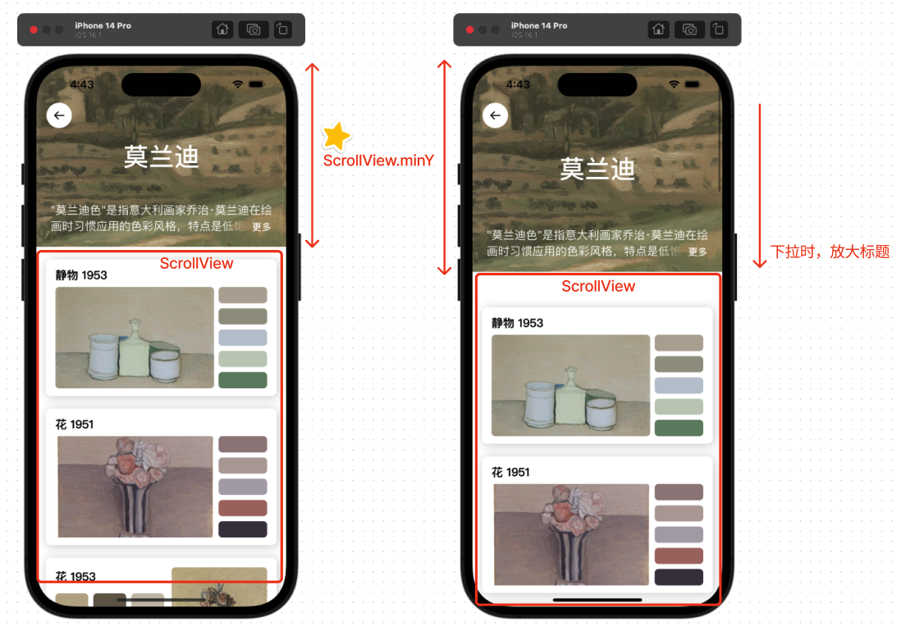

# SwiftUI - 获取目标视图 Frame

> 太长不看版，代码实现：[FrameGetter](https://github.com/RickeyBoy/Rickey-iOS-Notes/blob/master/Notes/SwiftUI/FrameGetterExtension.swift)

### 需要获取 Frame 的场景

通常我们使用 SwiftUI 布局 UI 时，利用 VStack、HStack 等即可约束不同 View 之间的位置关系，因此不会再需要获取指定 View 的 Frame。但是有些时候为了实现复杂的页面，或者为了一些布局相关的计算时，就不得不获取 Frame。

比如下面这个场景，为了实现下拉时放大标题的效果，必须要获取 ScrollView 的 minY，从而计算出顶部区域的放大倍数：




### 初尝使用 GeometryReader

> [GeometryReader - Apple doc](https://developer.apple.com/documentation/swiftui/geometryreader)
>
> A container view that defines its content as a function of its own size and coordinate space.

使用 GeometryReader 可以在布局时获取到对应 View 在指定坐标系的布局信息，我们可以利用这个特点将 frame 信息读取出来。

```SwiftUI
@State var frame: CGRect = .zero

var body: some View {
    GeometryReader { geometry in
        self.frame = geometry.frame(in: .global)
        MainContent()
    }
}
```

当然我们不能直接设置，因为 block 内的内容必须要遵循 View 协议，直接这样写编译器无法推断。

> [View - Apple doc](https://developer.apple.com/documentation/swiftui/view)
>
> You create custom views by declaring types that conform to the `View` protocol. Implement the required `body` computed property to provide the content for your custom view.


当然，我们将布局代码提取出来，明确返回值即可：

```swiftUI
var body: some View {
    GeometryReader { geometry in
        makeView(geometry)
    }
}

func makeView(_ geometry: GeometryProxy) -> some View {
    print(geometry.size.width, geometry.size.height)
    self.frame = geometry.frame(in: .global)
    return MainContent()
}
```

不过现在有新的问题产生：在布局阶段，不能够更改 @State 关键字修饰的属性。


这个问题的原因在于，@State 关键字的含义简单来说，其实就是 View 的状态；而如果在计算 View 的时候更改 @State，那就有可能造成时序上的混乱，导致布局错误，所以必须要将 @State 变量的修改延后一个周期。

于是现在的完整代码变成了：

```swiftUI
struct ContentView: View {
    
   @State var frame: CGRect = .zero
    
    var body: some View {
        GeometryReader { (geometry) in
            self.makeView(geometry)
        }
    }
    
    func makeView(_ geometry: GeometryProxy) -> some View {
        print(geometry.size.width, geometry.size.height)
        DispatchQueue.main.async { self.frame = geometry.frame(in: .global) }
        return MainContent()
    }
}
```


### 最终实现便捷的 Extension： FrameGetter

首先，我们将已有的部分提取到 ViewModifier 中，当然需要一定的改造 —— 将 GeometryReader 的部分放入 background 中使用。这样做既不会影响布局的获取，又能快捷优雅，并且避免 body 直接返回 GeometryReader 导致的类型推断错误。

```SwiftUI
extension View {
    func frameGetter(_ frame: Binding<CGRect>) -> some View {
        modifier(FrameGetter(frame: frame))
    }
}

struct FrameGetter: ViewModifier {
    @Binding var frame: CGRect
    
    func body(content: Content) -> some View {
        content
            .background(
                GeometryReader { proxy -> AnyView in
                    let rect = proxy.frame(in: .global)
                    DispatchQueue.main.async {
                        self.frame = rect
                    }
                    return AnyView(EmptyView())
                })
    }
}
```

使用起来也很简单：

```SwiftUI
struct MyView: View {
    @State private var frame: CGRect = CGRect()

    var body: some View {
        Rectangle()
            .frameGetter($frame)
    }
}
```


