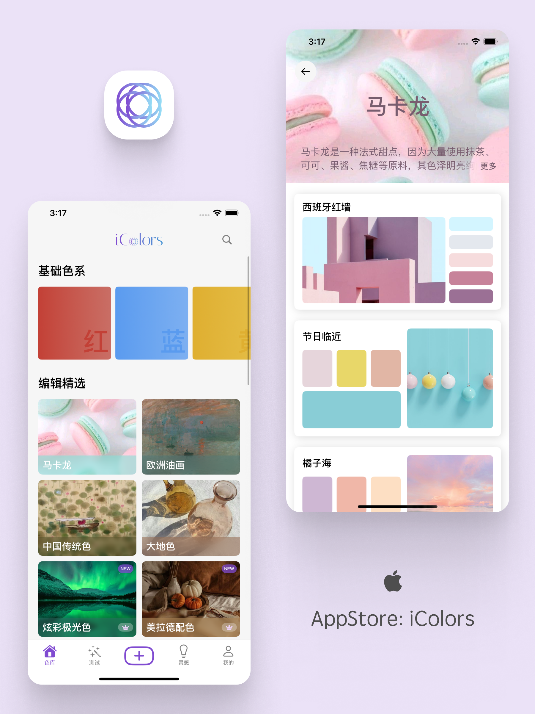

# 独立开发之 App 国际化全步骤

> 关于我：大厂摸鱼 + 业余独立开发，之后会输出深度技术文章 + 独立开发技巧
>
> 我的往期技术文章合集：[RickeyBoy - Gitbub](https://link.juejin.cn/?target=https%3A%2F%2Fgithub.com%2FRickeyBoy%2FRickey-iOS-Notes)
>
> 我的独立开发 App：[iColors - 设计灵感 配色助手](https://link.juejin.cn/?target=https%3A%2F%2Fapps.apple.com%2Fapp%2Fid6448422065)

对于一个独立 app 来讲，国际化出海是一个非常重要的步骤，海外广阔的市场和购买力，在营销跟上的情况下，是一个非常不错的收入来源。

在做国际化之前，其实我在网络上也找过很多的资料和教程，不过绝大部分教程只是讲解了其中的一个步骤，比如通过 localizable 文件实现多语言。但是这些教程普遍只适合架构比较简单的 app，涉及到固定文案、且文案数量不多的情况，并且实操性有限。

所以本系列会以我自己的独立 app：「iColors」 为例，全方位讲解其中涉及到的各个步骤的原理和方法，感兴趣 or 觉得有用的朋友可以点赞收藏。要是觉得非常有用，可以去 App Store 下载一下我的 App，点个五星好评哈哈！

实际效果图示：

| 中文版                                                    | 英文版                                                    |
| --------------------------------------------------------- | --------------------------------------------------------- |
|  |  |


# 🌏 为什么要做国际化

做之前先想清楚为什么要做。

对于一些大 app 而言，做国际化肯定是一件理所应当的事情。那么作为一个独立 app 而言为什么要做国际化？简单而言，那就是用户基数的扩大，再叠加海外用户的付费能力更强。

### 用户基数成规模的扩大

这一点是非常容易容易理解，毕竟全球用户会更多。其实即便没有做国际化多语言适配，App 也是可以上架所有国家的，但是这里有两方面的问题：

1. App 在所有国家只能拥有默认语言版本（比如中文）的 AppStore 介绍页，以及 AppStore 搜索关键词。那么可以想象，自然流量就几乎不存在了。
2. 如果没有实现对应语言，或者没有英语的情况下，用户很容易遇到下载了却无法使用的情况。这样很容易导致在 AppStore 海外市场被打低分。

### 海外用户的付费能力

这是老生常谈的一点，整体而言海外用户的付费能力和付费意愿都会比国内更强。海外用户已经习惯了为喜爱的 app 或者是工具付费，如果足够喜欢是很愿意付高价的。并且由于汇率等一些原因，国内软件的价格对于海外用户而言是相对划算的一笔钱。所以可想而知，单个用户的价值是会相对更高一点的。

所以非常明显，即便做国际化需要较为复杂的工作量，也是值得做的，尤其是对于独立 app 而言更是如此。


# 📏 开始前的准备

好的，再决定了要做国际化适配多语言之后，我们可以正式开始这部分的实操了。这里先简单说一下我自己的项目技术栈：

- 代码语言：SwiftUI
- 数据存储：CoreData

- App 初始语言：中文

- App 目标语言：英文

这里再多说一句，一方面我目前的独立 App 功能算是非常完善了；同时因为我这里涉及到了 CoreData 作为数据存储中心之一，需要考虑 CoreData 模型升级，导致整个过程会更加复杂。

如果你的 App 只是一个小型工具，不涉及数据本身的多语言适配，或者 App 文案大多数是通过写死的方式存在，那么应该会更加简单一些。

另外，过程中会使用到 ChatGPT（免费的就够了），相信大家都已经有账号了吧！整个过程中我感觉现在 AI 对于生产力是真的有明显提升的，习惯使用的话确实很有帮助。毕竟程序员，善用各种工具是基本素质了。


# CoreData 部分


## 第一步：提取 CoreData 文案

ChatGPT 脚本 + 提取目标颜色


## 第三步：翻译文案


## 第四步：将 CoreData 数据对应的文案塞入


## 第五步：CoreData 数据升级


## 替换模型在 App 中的使用


### 如何查看 CoreData 数据

https://stackoverflow.com/a/49044302


## App 内文案部分


## 提取 APP 内文案

通过 Xcode 工具自动提取

通过手动查漏补缺


# 通过 ChatGPT 生成对应的 Key


## Xcode 中生成 Localized.strings 文件


## 通过脚本生成 strings 文件


## 替换 App 中的文案


## 技巧：Text 后可以直接跟 localization key

Text(LocalizedStringKey("somekey")) == Text("somekey")

可以这样全局替换：


- `Text\(LocalizedStringKey\("(.+?)"\)\)`
- `Text\("$1"\)`


另外，button + navigationTitle 等也是 OK 的


注意：Text(LocalizedStringKey(item.nameKey)) 这种类型需要手动加上，否则不会切换


# 语言选择与逻辑


### iOS 中的语言逻辑

zh-Hans 和 zh_CN 的区别：

一个是语言脚本，一个是地区


如何转化：

https://stackoverflow.com/a/45299393

参考：

scriptLanguageCode


## 增加语言选择页面

https://github.com/Abedalkareem/LanguageManager-SwiftUI


# 最终语言检索


# 其他细节语言的适配


## 通知语言适配

使用 InfoPlist.strings 即可


## 小组件语言适配

Localizable.strings 中的内容，可以和主工程的放在一块儿


切换语言时通知到小组件：

WidgetCenter.shared.reloadTimelines(ofKind: "CodeModulesWidget")

以及通过 group userdefaults 共享组件语言选择


## App Store 上订阅文案


## 关于日期的适配


https://stackoverflow.com/a/36060399

```swift
func currentMonth(for locale: Locale) -> String {
    let calendar = Calendar.current
    let month = calendar.component(.month, from: self)

    let dateFormatter = DateFormatter()
    dateFormatter.locale = locale

    if let monthSymbols = dateFormatter.standaloneMonthSymbols {
        let monthSymbol = monthSymbols[month - 1]
        return monthSymbol
    } else {
        return ""
    }
}
```


### 小技巧： Preview 中设置语言

.environment(\.locale, .init(identifier: "en"))

.environment(\.locale, .init(identifier: "zh-Hans"))


### 带参数的 Localizable.strings 实现

https://stackoverflow.com/a/69469050


## 搜索的适配


